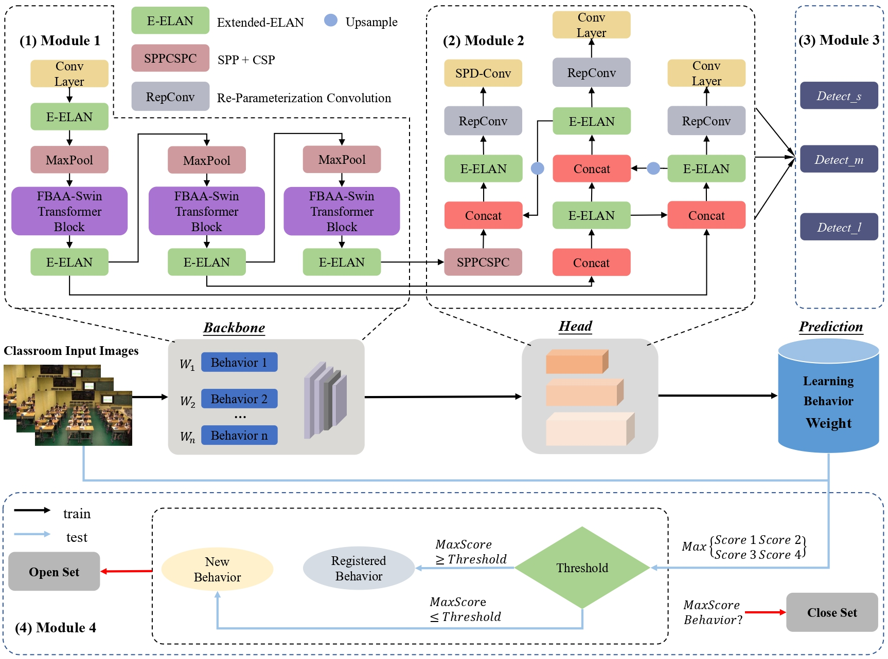
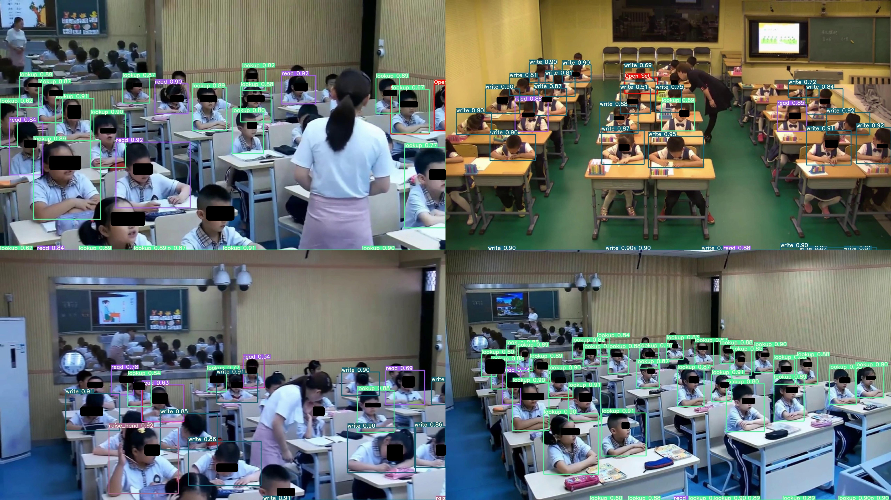

# SLBDetection-Net: Towards closed-set and open-set student learning behavior detection in smart classroom of K-12 education
---
## Citations
If you want to use this dataset  in your research, please cite the following works:
### APA
[1] Wang, Z., Li, L., Zeng, C., Dong, S., & Sun, J. (2025). SLBDetection-Net: Towards closed-set and open-set student learning behavior detection in smart classroom of K-12 education. Expert Systems with Applications, 260, 125392. https://doi.org/10.1016/j.eswa.2024.125392

[2] Wang, Z., Wang, M., Zeng, C., & Li, L. (2024). SBD-Net: Incorporating Multi-Level Features for an Efficient Detection Network of Student Behavior in Smart Classrooms. Applied Sciences, 14(18), Article 18. https://doi.org/10.3390/app14188357

[3] Wang, Z., Yao, J., Zeng, C., Li, L., & Tan, C. (2023). Students’ Classroom Behavior Detection System Incorporating Deformable DETR with Swin Transformer and Light-Weight Feature Pyramid Network. Systems, 11(7), Article 7. https://doi.org/10.3390/systems11070372   

[4] Wang, Z., Li, L., Zeng, C., & Yao, J. (2023). Student Learning Behavior Recognition Incorporating Data Augmentation with Learning Feature Representation in Smart Classrooms. Sensors, 23(19), Article 19. https://doi.org/10.3390/s23198190    

[5] Wang, Z., Yao, J., Zeng, C., Wu, W., Xu, H., & Yang, Y. (2022). YOLOv5 Enhanced Learning Behavior Recognition and Analysis in Smart Classroom with Multiple Students. 2022 International Conference on Intelligent Education and Intelligent Research (IEIR), 23–29. https://doi.org/10.1109/IEIR56323.2022.10050042    
### BibTex
@inproceedings{Wang2022,
  title = {YOLOv5 Enhanced Learning Behavior Recognition and Analysis in Smart Classroom with Multiple Students},
  booktitle = {2022 International Conference on Intelligent Education and Intelligent Research (IEIR)},
  author = {Wang, Zhifeng and Yao, Jialong and Zeng, Chunyan and Wu, Wanxuan and Xu, Hongmin and Yang, Yang},
  year = {2022},
  month = dec,
  pages = {23--29},
  publisher = {IEEE},
  doi = {10.1109/IEIR56323.2022.10050042}
}

@article{Wang2023a,
  title = {Students' Classroom Behavior Detection System Incorporating Deformable DETR with Swin Transformer and Light-Weight Feature Pyramid Network},
  author = {Wang, Zhifeng and Yao, Jialong and Zeng, Chunyan and Li, Longlong and Tan, Cheng},
  year = {2023},
  month = jul,
  journal = {Systems},
  volume = {11},
  number = {7},
  pages = {372},
  publisher = {Multidisciplinary Digital Publishing Institute},
  issn = {2079-8954},
  doi = {10.3390/systems11070372},
  urldate = {2023-07-21},
  copyright = {http://creativecommons.org/licenses/by/3.0/},
  langid = {english}
}

@article{Wang2023b,
  title = {Student Learning Behavior Recognition Incorporating Data Augmentation with Learning Feature Representation in Smart Classrooms},
  author = {Wang, Zhifeng and Li, Longlong and Zeng, Chunyan and Yao, Jialong},
  year = {2023},
  month = jan,
  journal = {Sensors},
  volume = {23},
  number = {19},
  pages = {8190},
  publisher = {Multidisciplinary Digital Publishing Institute},
  issn = {1424-8220},
  doi = {10.3390/s23198190},
  urldate = {2023-10-07},
  copyright = {http://creativecommons.org/licenses/by/3.0/},
  langid = {english}
}

@article{Wang2024,
  title = {SBD-Net: Incorporating Multi-Level Features for an Efficient Detection Network of Student Behavior in Smart Classrooms},
  shorttitle = {SBD-Net},
  author = {Wang, Zhifeng and Wang, Minghui and Zeng, Chunyan and Li, Longlong},
  year = {2024},
  month = jan,
  journal = {Applied Sciences},
  volume = {14},
  number = {18},
  pages = {8357},
  publisher = {Multidisciplinary Digital Publishing Institute},
  issn = {2076-3417},
  doi = {10.3390/app14188357},
  urldate = {2024-09-17},
  copyright = {http://creativecommons.org/licenses/by/3.0/},
  langid = {english}
}

@article{Wang2025,
  title = {SLBDetection-Net: Towards Closed-Set and Open-Set Student Learning Behavior Detection in Smart Classroom of K-12 Education},
  shorttitle = {SLBDetection-Net},
  author = {Wang, Zhifeng and Li, Longlong and Zeng, Chunyan and Dong, Shi and Sun, Jianwen},
  year = {2025},
  month = jan,
  journal = {Expert Systems with Applications},
  volume = {260},
  pages = {125392},
  issn = {0957-4174},
  doi = {10.1016/j.eswa.2024.125392},
  urldate = {2024-09-19}
}

---
**SLBDetection-Net** is a cutting-edge method designed to improve the detection and representation of student learning behaviors in both closed-set and open-set classroom scenarios. Traditional methods often focus on behavior detection in limited or controlled environments, which can be inadequate for complex, real-world classroom settings.



### Key Features:
   - **Multi-scale Focusing Key Information (MFKI)**: Focuses on accurately capturing learning behavior across different scales.
   - **Learning Behavior-aware Attention (LBA)**: An advanced mechanism for extracting key features and capturing complex characteristics of behaviors.
   - **LBA-Swin Transformer Block**: A specialized backbone network feature encoder that enhances the performance of SLBDetection-Net.
---
## Requirements
It's hard to reproduce the results without the same devices and environment. Although our code is highly compatible with mulitiple python environments, we strongly recommend that you create a new environment according to our settings.
   - matplotlib>=3.2.2
   - matplotlib>=3.2.2 
   - numpy>=1.18.5,<1.24.0 
   - opencv-python>=4.1.1 
   - Pillow>=7.1.2 
   - PyYAML>=5.3.1 
   - requests>=2.23.0 
   - scipy>=1.4.1 
   - torch>=1.7.0,!=1.12.0 
   - torchvision>=0.8.1,!=0.13.0 
   - tqdm>=4.41.0 
   - protobuf<4.21.3

## Data preparation
Please manage to acquire the original datasets and then run these scripts.

#### ClaBehavior
The original dataset can be acquired freely in the repository of [ClaBehavior](https://github.com/CCNUZFW/Student-behavior-detection-system). Please download ClaBehavior (coco format) and convert it to .xml format for experimentation.

#### Student Classroom Behavior dataset (SCB)
The raw data is available [here](https://github.com/Whiffe/SCB-dataset?tab=readme-ov-file), the database publisher provides several versions of the dataset, this paper uses version 1. please download and use it.


## Test
If you would like to evaluate these methods on a dataset, download the [weights](). Then run the following script.

``` shell
python test.py --data data/slb.yaml --img 640 --batch 32 --conf 0.001 --iou 0.65 --device 0 --weights best.pt 
```
Here, we provide inference results for example data.


## Training
If you tend to evaluate these methods on your own dataset, please make sure to organize your data in the yolo format.

Single GPU training

``` shell
# train models
python train.py --workers 8 --device 0 --batch-size 32 --data [coco.yaml]l --img [640 640] --cfg [] --weights '' --name yolov7
```

Multiple GPU training

``` shell
# train models
python -m torch.distributed.launch --nproc_per_node 4 --master_port 9527 train.py --workers 8 --device 0,1,2,3 --sync-bn --batch-size 128 --data [coco.yaml] --img [640 640] --cfg [] --weights '' --name yolov7
```
## Representations
This project is intended for educational and research purposes only. When using this project, the user should ensure compliance with all applicable laws and regulations. The authors are not responsible for any legal issues or disputes arising from the use of this project.

## Acknowledgements

<details><summary> <b>Expand</b> </summary>

* [https://github.com/meituan/YOLOv6](https://github.com/meituan/YOLOv6)
* [https://github.com/WongKinYiu/PyTorch_YOLOv4](https://github.com/WongKinYiu/PyTorch_YOLOv4)
* [https://github.com/WongKinYiu/yolov7](https://github.com/WongKinYiu/yolov7)
* [https://github.com/ultralytics/yolov3](https://github.com/ultralytics/yolov3)
* [https://github.com/ultralytics/yolov5](https://github.com/ultralytics/yolov5)
* [https://pytorch.org/vision/stable/_modules/torchvision/models/detection/faster_rcnn.html#fasterrcnn_resnet50_fpn](https://pytorch.org/vision/stable/_modules/torchvision/models/detection/faster_rcnn.html#fasterrcnn_resnet50_fpn)
* [https://github.com/tensorflow/tpu/tree/master/models/official/efficientnet](https://github.com/tensorflow/tpu/tree/master/models/official/efficientnet)
</details>
